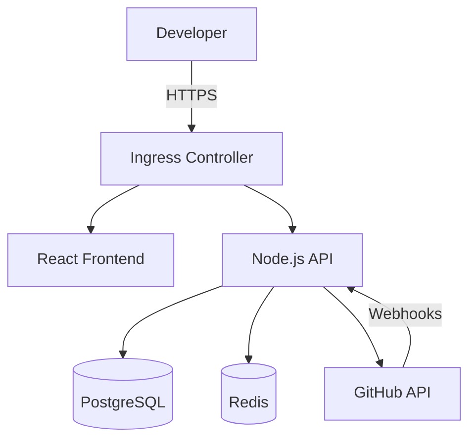

# DevCollab

> Unified developer team collaboration dashboard aggregating GitHub activity, CI/CD status, and sprint progress.

## Problem Statement

Engineering teams waste 2-3 hours daily context-switching between:

- GitHub (PRs, reviews)
- CI/CD dashboards (GitHub Actions, Jenkins)
- Project management tools (Jira)
- Communication platforms (Slack, on-call rotations)

**DevCollab provides a single view: "What is my team shipping right now?"**

## Architecture Overview

