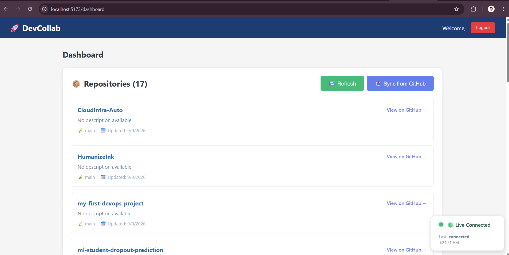

# DevCollab : GitHub repository sync and WebSocket dashboard for engineering teams

Unified dashboard for engineering teams to authenticate with GitHub, sync repositories, and view WebSocket connection status in one place.

*(Screenshot: real dashboard showing synced repositories)*



## Tech Stack

| Technology | Version / role | Why |
| --- | --- | --- |
| React + Vite | React 19.2, Vite 7.3 | Vite provides a fast development server and production bundling for the React client. |
| Fastify | 5.7 | Fastify offers a small, plugin-based HTTP server with lower abstraction overhead than Express for this API. |
| TypeScript | 5.9, strict mode | Strict typing catches integration errors across the frontend, backend, Prisma client, and API payloads before runtime. |
| Prisma | 5.22 | Prisma provides typed database queries and migrations without hand-written SQL or the heavier mapping layer of a traditional ORM. |
| PostgreSQL | 16 Alpine in Docker | PostgreSQL supplies relational constraints and durable storage for users, teams, and repositories. |
| Native WebSocket | `@fastify/websocket` 11.2 and browser WebSocket | Native WebSocket keeps the current connection-status and echo feature simple without adding a server-side Socket.IO protocol layer. |
| Redis | 7 Alpine in Docker | Redis is included in the local stack for future caching or real-time coordination, but is not yet consumed by the application code. |
| GitHub OAuth/API | `@fastify/oauth2` 8.2 | GitHub OAuth avoids storing passwords, while the GitHub API supplies account and repository data for synchronization. |

## Architecture

```text
Browser
  |
  | React/Vite HTTP + native WebSocket
  v
Fastify backend
  |-- GitHub OAuth and GitHub API
  |-- JWT session validation
  |-- Native WebSocket endpoint: /ws/updates
  |
  |--> PostgreSQL (users, teams, repositories)
  `--> Redis (provisioned local service; reserved for future use)
```

The OAuth flow starts at `GET /github`, returns through
`GET /github/callback`, creates or updates a local user, and redirects the
frontend with a signed JWT session token.

## Features

- GitHub OAuth login and OAuth callback handling.
- JWT session tokens and a protected `/me` endpoint.
- Development-only login through `POST /auth/dev-login`.
- GitHub account detection for personal users and organizations.
- Repository synchronization from a personal GitHub account or organization.
- PostgreSQL persistence for users, teams, and synced repositories.
- Repository dashboard with refresh, sync, repository metadata, and GitHub links.
- Native WebSocket connection status and welcome/echo messages at `/ws/updates`.
- GitHub Actions CI that installs dependencies, generates Prisma Client, and builds both apps.
- Fully containerized application (backend, frontend, PostgreSQL, and Redis) with one-command startup.
- CI verifies that both Docker images build successfully.

The current WebSocket implementation reports connection/message status; it does
not yet stream GitHub Actions or CI events.

## Quick Start

### Prerequisites

- Node.js 20+
- Docker Compose
- A GitHub OAuth App with a callback URL matching the backend configuration

### Setup

Docker Compose starts the entire stack—PostgreSQL, Redis, backend, and frontend—with
one command. This is a meaningful improvement over the previous manual
multi-terminal setup.

```bash
git clone <repo>
cd devcollab
copy apps\backend\.env.example apps\backend\.env
```

Fill in `GITHUB_CLIENT_ID`, `GITHUB_CLIENT_SECRET`, `GITHUB_CALLBACK_URL`, and
`JWT_SECRET` in `apps\backend\.env`, then build and start everything:

```bash
docker-compose up -d --build
docker-compose exec backend npx prisma migrate deploy
```

Open `http://localhost:5173`.

The optional Adminer database UI is available with:

```bash
docker-compose --profile tools up -d
```

Then visit `http://localhost:8080`.

### Local development without Docker

Docker rebuilds are slower for iterative coding. For hot-reload development,
run the backend and frontend separately:

```bash
cd apps\backend
npm install
npx prisma migrate dev
npm run dev
```

```bash
cd apps\frontend
npm install
npm run dev
```

The backend uses `ts-node-dev` for hot reload and the frontend uses the Vite
development server at `http://localhost:5173`.

## Roadmap

### ✅ Done

- GitHub OAuth login and JWT sessions.
- WebSocket-backed real-time connection/status dashboard panel.
- Prisma/PostgreSQL data model and repository persistence.
- GitHub personal-account and organization repository sync.
- CI pipeline for backend and frontend builds.
- Docker Compose local PostgreSQL, Redis, and optional Adminer stack.
- Docker Compose local stack for the full application.
- Fully containerized backend and frontend with one-command startup.
- CI verification that both Docker images build successfully.

### ⏳ Planned

- Kubernetes deployment.
- Terraform/IaC.
- GitOps workflows.
- Prometheus/Grafana observability.
- Automated unit and integration tests.
- GitHub Actions/CI event ingestion and live status updates.
